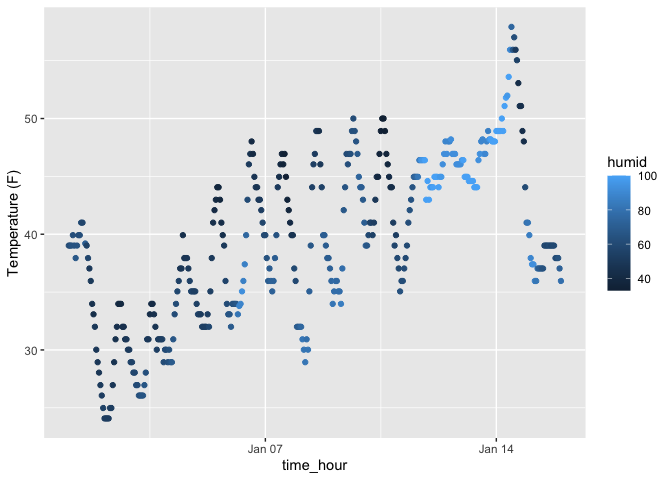

p8105_hw1_sc5826
================
Shivalika Chavan
2025-09-11

**Problem 1**

``` r
library(tidyverse)
library(moderndive)
data("early_january_weather")
```

The `early_january_weather` dataset has 15 variables (origin, year,
month, day, hour, temp, dewp, humid, wind_dir, wind_speed, wind_gust,
precip, pressure, visib, time_hour). It contains weather data
originating from EWR, between days 1 and 15 of the 1st month of 2013
(January 1-15, 2013). Data was recorded between 2013-01-01 01:00:00 and
2013-01-15 23:00:00. There are 358 total observations during this
period.

With temperature ranging between 24.08 and 57.92, we can assume these
were in Fahrenheight. The mean temperature observed in this period was
39.58F.

<!-- -->
There is a cyclical pattern observed in temperature, where the weather
appears to peak mid-day and then falls during the night. The peaks
appear to trend upward (temperature is getting warmer), until January
14th, where it steeply drops further down. Right before the steep drop
in temperature, there also is a sharp increase in the humidity to 100.
This is higher than the average humidity during this period of
observation (65).
